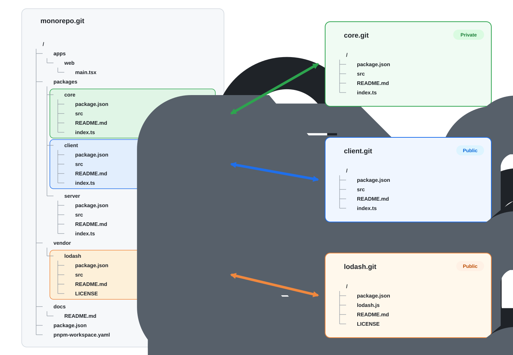

# Monosplice 

### git submodules for mere mortals

Monorepos are awesome.  Everything is synchronized and references each other in lock step.  But the world is harsh towards monorepos.  Sometimes we need to open source a package... other times we need to import a 3rd party vendor.   Monorepos break under these conditions.  

In the beginning, there were `git submodules`.  It was better than nothing, but oh so painful to use. 

Then came `git subtree`, which was better, but still too complicated to really use day-to-day.

Now, I give you `monosplice`.  A CLI that makes it easy'ish to push & pull subrepos from your monorepo. 

---

Keep everything in one monorepo, and splice any directory out as a real, standalone git
repo. `push` exports your commits to it; `pull` replays outside contributions back in —
commit by commit, authors and messages intact. Unlike `git subtree`, exports are
per-commit, filterable, and scannable before anything leaves.

<p align="center">
  
</p>

No submodules, no gitlinks, no special clone steps for contributors. The monorepo stays a
completely normal git repo; so does every repo spliced out of it — and as the diagram's
`core.git` shows, a spliced repo doesn't have to be public. Use it to open-source part of a
larger codebase, to vendor a third-party project you patch, or to maintain patches on a
fork — monosplice keeps a PR branch rebased on upstream for you.

## Install

```sh
npm install -g monosplice
```

Requires Node ≥ 20 and git ≥ 2.30. Prefer an install script or a pinned tarball? See
[install options](docs/reference.md#install-options).

## Quickstart

One-time setup, then pick the scenario that matches yours. All three use one command:
`attach` looks at which side already has content and does the right thing.

```sh
cd ~/code/my-monorepo
monosplice init          # writes monosplice.config.ts
```

### I have a monorepo and want to extract a subrepo

```bash
# Create a new repo at github.com:acme/core.git
$ monosplice attach ./core git@github.com:acme/core.git
```


### I have a monorepo and want to import an external repo

```sh
monosplice attach ./packages/auth git@github.com:acme/auth.git
```

`packages/auth/` doesn't exist yet, so attach copies the repo's current tree there in a
single commit and records which remote commit it came from. You're in sync immediately — no
need to replay the remote's history (though `--import-history` will, if you want it in your log).
Edge cases — the folder already has content, the trees differ — are covered in
[connecting a repo that already exists](docs/reference.md#connecting-a-repo-that-already-exists).

### I have a vendor repo and want to splice it

```sh
monosplice attach ./vendor/lodash git@github.com:lodash/lodash.git
```

The same move as importing — the `vendor/` prefix is just convention. From then on it's a
normal directory: patch it in ordinary commits, and `monosplice pull lodash` three-way
merges upstream updates underneath your patches. To send patches *back* to a project you
can't push to, see the [fork workflow](docs/reference.md#pushing-patches-back-upstream-fork-workflow).

### Then just work

Whatever you attached, daily life is ordinary git plus one verb:

```sh
git commit -am "feat(core): add the greeter"
git commit -am "chore(website): copy tweaks"   # touches nothing in core/, never exported

monosplice status   # core: 1 to push
monosplice push     # exports the core/ commit, and only that one
```

When someone lands a PR against the standalone repo:

```sh
monosplice pull     # replays it into core/, original author preserved
monosplice sync     # pull then push, in one go
```

When you need more — `exclude` globs, secret-scan and tree-transform hooks, the fork
workflow — it's all in [configuration & hooks](docs/reference.md#configuration).

## Commands

| Command | What it does |
| --- | --- |
| `monosplice init` | Write a starter `monosplice.config.ts`. |
| `monosplice push [subrepo]` | Export new monorepo commits to the standalone repo(s). |
| `monosplice pull [subrepo]` | Import new standalone-repo commits into the monorepo. `--continue` resumes after a conflict, `--abort` throws it away. |
| `monosplice sync [subrepo]` | Pull, then push — converge both sides. |
| `monosplice status [--json] [--check]` | Per-subrepo "N to push, M to pull", or "in sync". `--check` exits 1 unless everything is converged. |
| `monosplice attach <folder> [git-url]` | Connect `<folder>` to a repo — creates the config entry and makes first contact. See Quickstart. |
| `monosplice doctor [--json]` | Verify the derived sync state against reality; non-zero exit on problems. |
| `monosplice tag <subrepo> <tag>` | Tag the standalone repo at the commit matching monorepo HEAD. |
| `monosplice update` | Self-update from npm. |

Full flags and edge-case behaviour: [docs/reference.md](docs/reference.md).

## How it works

**Two histories, one mapping.** The monorepo and each standalone repo have independent
histories; monosplice replays commits between them and records the correspondence in commit
trailers (the `Key: value` lines git keeps at the end of a commit message) — exports carry
`Monosplice-Source: <monorepo-sha>`, imports carry `Monosplice-Origin: <standalone-sha>`. Each
export is built with git plumbing (`ls-tree`, `mktree`, `commit-tree`) and preserves the
original author and dates. The remote ref is written exactly once — after every commit and
every hook has succeeded. Commits that touch nothing exportable produce no commit on the
other side, and a squash-merged PR converges by itself: the squashed commit imports as the
new anchor, and nothing gets re-published or ping-pongs.

**There is no persistent state file.** Nothing on disk records "where we got to" — the only
thing ever written under `.git/monosplice/` is a transient conflict sequencer, exactly like
git's own `.git/rebase-merge`. Every run re-derives the sync point from the trailers, and a
commit counts as synced when the sync point descends from it — which is why attaching a
200-commit repo with a single snapshot commit reports "in sync", not "200 to pull". A fresh
clone on a new machine can push, pull and sync immediately: no cache to invalidate, no
lockfile to conflict on. And when the picture doesn't add up (shallow clone, rewritten
history), monosplice stops and says so rather than guessing.

**Hooks run before anything leaves.** `exclude` globs filter files out of the export, and
three per-commit TypeScript hooks — `scan`, `transform`, `rewriteMessage` — inspect or
rewrite each outgoing tree; throwing aborts the whole push with nothing published. A secret
scan runs against *every* exported commit, so a key that was added and deleted still blocks
the push. See [configuration & hooks](docs/reference.md#configuration).

**Conflicts are just merges.** Imports apply with `git apply --3way`, so concurrent edits to
different lines merge silently. A real conflict leaves standard markers; you resolve,
`git add`, `monosplice pull --continue` — or `monosplice pull --abort` to put the monorepo
back exactly as it was. A resolution you keep is re-exported, so neither side loses it.
Details: [the conflict flow](docs/reference.md#the-conflict-flow).

## Compared to the alternatives

| | git submodule | git subtree | git-subrepo | josh | Copybara | monosplice |
| --- | --- | --- | --- | --- | --- | --- |
| Files in the monorepo | pointer, not content | real files | real files | real files | real files | real files |
| Contributor setup | `submodule update --init`, forever | none | none | clones go through the proxy | none | none |
| Export granularity | n/a (same repo) | squash or graft | squashed per push | per commit (deterministic filter) | per commit | per commit |
| Contributions back in | manual, by hand | `subtree pull` (merge noise) | `subrepo pull` (squash) | push through the proxy | yes, workflow-driven | yes, `monosplice pull` with 3-way merge |
| Secret scan / tree transform | no | no | no | path filters only | yes (Starlark) | yes (TypeScript hooks) |
| Where the mapping lives | gitlink shas | subtree merge commit messages | `.gitrepo` file committed in your tree | nowhere — deterministic rewrite | labels in commit messages | commit trailers, re-derived every run |
| Runtime | git | git | bash | Rust proxy server you host | Java (+ Bazel to build) | Node ≥ 20 |
| Scope | vendoring dependencies | grafting a directory in/out | one dir ↔ one repo | serving many filtered views of a big monorepo | large-scale internal→external pipelines | one monorepo publishing a handful of directories |

Short version: submodules make the *contributor* pay for your publishing strategy.
`git subtree` moves directories but has no excludes, no transforms, no scan that can block a
push, and its history gets noisy fast. `git-subrepo` is the closest cousin — same
one-dir↔one-repo shape — but it squashes on both sides and keeps its mapping in a
`.gitrepo` state file committed into your tree, where monosplice keeps per-commit fidelity
and derives the mapping from trailers on every run. `josh` solves a different problem
beautifully — serving many filtered views of one big monorepo — at the price of running a
proxy server everyone clones through. Copybara does all of this and more, and is far more
mature — but it's a Java/Bazel deployment with Starlark configs. Heavy, if all you have is
one repo and one `core/` directory. monosplice aims at that smaller case with a config file
you can read in ten seconds.

## Limitations

The honest list, current as of v0.x:

- **One branch per subrepo.** monosplice syncs the configured branch (default `main`) and
  nothing else; feature-branch export is on the roadmap.
- **Exported commits are watermarked.** Every export carries a
  `Monosplice-Source: <monorepo-sha>` trailer. That trailer *is* the sync mapping, so
  `rewriteMessage` runs before it is appended and cannot strip it — private-monorepo SHAs
  appear in standalone-repo history, permanently. They reveal nothing but 40 hex characters,
  but know it's there before you publish.
- **No shallow clones.** Sync state is re-derived by walking history, so a shallow monorepo
  clone stops with an error rather than guessing.
- **`status` talks to the network.** Re-deriving state is a couple of `git log` scans per
  subrepo — cheap. Fetching each remote, which every run also does, is what you actually
  wait on. An offline mode is planned.
- **Node ≥ 20 runtime.** This is a TypeScript CLI, not a git subcommand.

## Going deeper

- [Connecting a repo that already exists](docs/reference.md#connecting-a-repo-that-already-exists)
- [Vendoring a third-party project](docs/reference.md#vendoring-a-third-party-project)
- [Fork workflow — PRs back upstream](docs/reference.md#pushing-patches-back-upstream-fork-workflow)
- [Configuration & hooks](docs/reference.md#configuration)
- [The conflict flow](docs/reference.md#the-conflict-flow)
- [Install options & releasing](docs/reference.md#install-options)

## Development

```sh
pnpm install
pnpm build          # tsc → dist/
pnpm typecheck      # tsc --noEmit
pnpm test           # unit tests only (fast)
pnpm test:e2e       # build, then the black-box CLI suite
pnpm test:all       # build, then everything
```

The project is test-driven: new behaviour starts as a scenario in
[`docs/e2e-scenarios.md`](docs/e2e-scenarios.md), gets a failing black-box test in
`test/e2e/` (or a unit test in `test/unit/` for pure logic), then the implementation. E2E
tests invoke the built binary and assert on exit codes, stdout and git state; "remotes" are
local bare repos, so the suite never touches the network. Releasing is
[tag-driven](docs/reference.md#releasing).

## Roadmap

Not built yet, in rough order of usefulness:

- **Branch export** — sync branches other than the configured one, so feature branches and release branches can be published too.
- **A GitHub Action** — run `monosplice sync` (or at least `monosplice status`) in CI on a schedule.
- **Standalone binaries** — `oclif pack` tarballs so the CLI can be installed without a Node toolchain.

## License

MIT.
